<!--
This file restructures papers/paper2-empirical.md into the exact section/
subsection hierarchy of Won et al. (2026), "Synthetic Data Augmentation for
Imbalanced Tabular Data: A Comparative Study of Generation Methods,"
Electronics 15(4), 883 (https://www.mdpi.com/2079-9292/15/4/883) -- the
target venue's own closest precedent. paper2-empirical.md remains the
source-of-truth analysis document (all numbers verified against raw CSVs
there); this file is a submission-formatted derivative, explicitly framed
as an extension of Won et al. along five of its own six stated limitations
(see Introduction).

Placeholder boilerplate sections (Author Contributions, Funding, IRB
Statement, Informed Consent, Conflicts of Interest) are marked TODO and
need Aditya's/coauthors' actual input -- not something to fabricate.
-->

# Synthetic Data Augmentation in the Extreme-Imbalance Regime: A Dose-Response Extension of Fidelity-Utility Benchmarking

**Authors:** Aditya Puttaparthi Tirumala [, coauthors TBD]

## Abstract

Practitioners facing severe class imbalance — email conversion rates below 1%, rare-event prediction in marketing classification — routinely turn to synthetic data augmentation, but existing benchmarks report aggregate generator rankings across heterogeneous tasks that don't answer the question that matters: given a specific positive rate and sample size, will augmentation help, and which method should be used? We answer this with a controlled study spanning seven datasets (0.2%–30% positive rate), five generators (GaussianCopula, CTGAN, SMOTE, TabDDPM, and GReaT at two LLM scales, GPT-2 and Mistral-7B), 5–10 seeds, four downstream classifier families, and two independent dose-response experiments that vary minority-class count while holding dataset identity fixed — directly testing whether scarcity itself, rather than which dataset happens to be at hand, drives the effect.

It does, but the finding is more useful than a single threshold. On two real marketing datasets — Hillstrom (0.9% positive) and Criteo (0.2%) — augmentation delivers +5.7 to +12.9 AUC points; on four balanced benchmarks at 11.7%–30%, no generator exceeds +0.27 points. We measure why: CTGAN's conditional sampler generates minority rows at 7–89× the natural rate, while TabDDPM and GaussianCopula sample unconditionally and underperform accordingly. The pattern holds across four classifier families, and is unchanged when GPT-2 in GReaT is replaced by the substantially larger Mistral-7B. On Criteo, 7 of 10 MLP seeds failed to converge on real data alone; CTGAN augmentation restored convergence in all 10.

But the exact point where augmentation stops helping and starts hurting is not a portable constant. A controlled within-dataset sweep — minority count varied from 16 to 1,024, total sample size held fixed — turns significantly harmful above roughly 1% positive rate on Bank Marketing. The same design on a second, higher-dimensional dataset (Nomao) holds the same direction, but the magnitude nearly vanishes: a near-ceiling baseline leaves little room to move. A single cutoff cannot be assumed to generalize.

The more surprising result concerns which method to use at all. ADASYN — free, instantaneous, and over fifteen years old — statistically ties CTGAN on both marketing datasets (paired test, p=0.97 and p=0.21), against the intuition that a modern deep generative model should win; SMOTE ties both as well. We also find CTGAN's own training is not reliably reproducible in the standard SDV implementation used here — a >10-point AUC swing from refitting on fully identical data and seed. To our knowledge this reliability gap has not been previously reported, and it likely affects prior CTGAN benchmarks generally. We disclose it as an open limitation rather than resolve it.

**Practical recommendation.** Below roughly 1% positive rate, try ADASYN or SMOTE before CTGAN — both are free and statistically indistinguishable from it here. Above 10%, augmentation is unlikely to help. The region in between is not a gap in this study — we tested it directly on two datasets — but the result is dataset-dependent rather than a single rule: augmentation was significantly harmful across most of this range on one dataset, and merely negligible on the other. Practitioners in this band should validate on their own data, not because the region is unstudied, but because our own two datasets already disagree on what happens there.

**Keywords:** synthetic data augmentation; class imbalance; CTGAN; ADASYN; dose-response; tabular classification; marketing analytics

---

## 1. Introduction

Marketing and product data scientists routinely face classification problems with severe class imbalance: email conversion rates below 1%, display ad click-through rates below 0.5%, and rare-event prediction across customer cohorts [Neslin et al., 2006; Johnson & Khoshgoftaar, 2019]. A growing body of work proposes synthetic data augmentation as a remedy: train a generative model on the available real data, sample synthetic examples, and combine them with the real training set to improve downstream classifier performance. The space of available generators has expanded rapidly — from interpolation-based oversampling (SMOTE, ADASYN, Borderline-SMOTE) through conditional GANs (CTGAN), copula-based parametric models (GaussianCopula), diffusion models (TabDDPM, TabSyn), and language-model-based synthesizers (GReaT).

This expansion has not been matched by corresponding clarity for practitioners. Existing benchmarks [Erickson et al., 2025; Davila et al., 2025] evaluate generators across heterogeneous tabular tasks and report aggregate rankings that do not answer the practitioner's actual question: *given my classification task at this positive rate and this sample size, which generator should I use, and will augmentation help at all?*

**This paper extends the broader benchmark literature, including the study closest to this question at the target venue: Won et al. [2026], published in Electronics, which compares SMOTE, GaussianCopula, TVAE, and CTGAN on a single banking dataset (UCI Bank Marketing, 7.88:1 imbalance) across statistical fidelity and machine learning utility, and reports a weak negative correlation between the two.** Won et al.'s own Limitations section (§5.6) identifies six specific gaps in their study; this paper directly addresses five of them along the dimensions of dataset breadth, generator coverage, and dose-response methodology. It does **not** extend Won et al.'s fidelity-measurement axis — the multi-dimensional statistical fidelity battery (marginal similarity, correlation preservation, KS tests) that their own study centers on is a distinct question (does statistical realism predict downstream utility?) from the one this paper asks (under what conditions does augmentation help, and why?). We measure one targeted fidelity quantity directly relevant to our own question (§2.4.2) rather than replicate their fidelity framework, and state this explicitly rather than leave it as an unexplained omission (§4.7).

The five gaps addressed:

1. *"the evaluation was conducted on a single dataset from the banking domain"* — we evaluate seven datasets spanning telecom, finance, lead-generation, and real marketing/advertising domains.
2. *"diffusion-based models (TabDDPM, TabSyn) and LLM-based generation (GReaT)... were not included"* — we include both TabDDPM and GReaT (at two LLM scales, GPT-2 and Mistral-7B).
3. *"three traditional machine learning classifiers... inclusion of deep neural network classifiers would broaden the assessment"* — we add a Multi-Layer Perceptron as a fourth classifier family.
4. *"formal PR-AUC computation... were not performed"* — we report Average Precision throughout.
5. *"all experiments were conducted at a single imbalance ratio (7.88:1)"* — we test positive rates from 0.2% to 30%, and additionally run two controlled dose-response sweeps that vary minority-class count independently of dataset identity, directly answering their own stated future-work request: *"systematic evaluation across a range of imbalance ratios... would reveal how the relative effectiveness of augmentation methods changes."*

The sixth gap — hyperparameter optimization for deep generative models to establish a performance ceiling — is only partially addressed: we use library defaults throughout, as Won et al. do, but additionally test TabDDPM at a 5× extended training budget and find performance *degrades* rather than improves, and we sweep the synthetic-to-real mixing ratio (a dimension neither study's future-work list mentions) across every generator.

One result previews why the practitioner-facing question matters: on Criteo Display Advertising (0.2% positive rate), 7 of 10 MLP seeds failed to converge using real data alone — the classifier predicted the majority class every time. After CTGAN augmentation, all 10 seeds converged. Augmentation in this regime is not a marginal improvement; it is the difference between a working classifier and a broken one.

Our contributions are:

1. **A seven-dataset, five-generator, four-classifier characterization of augmentation value**, directly extending Won et al.'s single-dataset, three-classifier, four-generator design along the dimensions listed above.
2. **A controlled dose-response design that disentangles minority-class count from dataset identity** — the first (to our knowledge) within-dataset test of this question, replicated on two datasets with different domains and dimensionality, directly answering the "range of imbalance ratios" question Won et al.'s own future-work section raises.
3. **A missing-baseline check that changes the practical recommendation**: ADASYN and SMOTE — both free — statistically tie CTGAN on both marketing datasets, against the assumption that a more sophisticated generator should win.
4. **A self-disclosed reliability finding**: CTGAN's own fit-to-fit randomness is uncontrolled in the standard SDV implementation, producing AUC swings comparable in magnitude to the paper's headline effect sizes — a limitation we believe has not been previously reported.
5. **A direct TabDDPM vs. CTGAN comparison at two training budgets**, showing extended training widens rather than closes the gap, consistent with an architectural (unconditional vs. conditional sampling) rather than undertraining explanation.

The paper is structured as follows. Section 2 describes datasets, experimental setup, generator implementations, and evaluation metrics. Section 3 reports results. Section 4 discusses mechanism, fidelity-utility trade-offs, and practical implications. Section 5 concludes.

---

## 2. Materials and Methods

### 2.1. Dataset Description

We selected seven publicly available classification datasets spanning the practitioner-relevant range of positive rates, summarized in Table 1. Five serve as controls (positive rate ≥ 11.7%) and two as the treatment condition (positive rate ≤ 0.9%, drawn from real marketing operations).

**Table 1 — Dataset characteristics.**

| Dataset | n (cap) | Positive rate | Domain | Source | Role |
|---|---|---|---|---|---|
| Telco Customer Churn | 7,032 | 26.6% | Telecom | IBM Kaggle | Control |
| Bank Marketing | 15,000 | 11.7% | Finance | UCI | Control |
| German Credit | 1,000 | 30.0% | Finance | OpenML id=31 | Control |
| Nomao Lead (full) | 10,000 | 28.3% | Lead generation | OpenML id=1486 | Control |
| Nomao Lead (sparse, 70% missing) | 500 | 28.3% | Lead generation | OpenML id=1486 | Sparsity stress |
| **Hillstrom Email Marketing** | **10,000** | **0.9%** | **Marketing** | MineThatData | **Treatment** |
| **Criteo Display Advertising** | **10,000** | **0.2%** | **Advertising** | Criteo AI Lab | **Treatment** |

Datasets larger than 10,000 rows are subsampled to the listed cap, defining the data-scarce minority-class regime this paper studies; at full dataset scale the marginal value of synthetic rows is expected to be smaller (see §4.6, Limitations). Two supplementary datasets — Bank Marketing's full UCI source (45,211 rows, 5,289 positives) and Nomao's full OpenML source (34,465 rows, 9,844 positives) — provide additional headroom for the dose-response design in §2.2.5 and are described there.

### 2.2. Experimental Setup

#### 2.2.1. Implementation Environment

Benchmark and confidence-interval experiments run on CPU (Apple M1 Pro). TabDDPM and GReaT experiments run on Databricks GPU clusters (NVIDIA T4/A10G for TabDDPM and GPT-2 GReaT; H100 for Mistral-7B GReaT, bf16 precision). Total compute: approximately 60 GPU-hours and 80 CPU-hours for the original experiments, plus an additional ~15 CPU-hours for the dose-response and missing-baseline extensions reported here. All generators are implemented via SDV v1.36 (GaussianCopula, CTGAN), imbalanced-learn v0.12 (SMOTE, ADASYN, Borderline-SMOTE, random undersampling), synthcity v0.2.11 (TabDDPM), and be-great v0.0.13 (GReaT). Classifiers are implemented via scikit-learn.

#### 2.2.2. Repeated Experiments and Statistical Analysis

All augmentation results use 5 seeds {42, 123, 7, 2024, 999}, with 95% confidence intervals computed via the t-distribution on per-seed values. Multi-classifier robustness extends to 10 seeds by adding {10, 20, 30, 40, 50}. We report paired t-tests on per-seed differences for all headline comparisons, with Benjamini-Hochberg FDR correction at q=0.10 over the family of 14 tests; effect sizes are Cohen's d_z. The sole exception is the TSTR protocol (§3.1), reported as a single-seed point estimate to match the prior work it is compared against [Davila et al., 2025].

#### 2.2.3. Data Preprocessing

Categorical features are label-encoded (GaussianCopula) or entity-embedded (CTGAN); numeric features are used as-is for tree-based classifiers. Missing values are imputed with column medians where required (Nomao). The `duration` feature is dropped from Bank Marketing (target leakage).

#### 2.2.4. Data Splitting Strategy

An 80/20 stratified train/test split is used for all main experiments. For the GReaT small-n experiments, a fixed 10,000-row holdout (random_state=42) is used across all training sizes and seeds, since a variable split would leave too few positive test examples at n=50. For the dose-response experiments (§2.2.5), a large fixed holdout (3,000 rows, stratified at the dataset's natural rate) is drawn once and reused across every minority-count condition, so holdout composition never varies within a dataset.

#### 2.2.5. Synthetic Data Generation Protocol

For each (dataset, generator, seed) triple we generate synthetic rows at a synthetic-to-real mixing ratio α ∈ {0.1, 0.2, 0.3, 0.5, 1.0}. GaussianCopula and CTGAN are refit independently at each α (no fit-once-and-subsample caching in this implementation); SMOTE/ADASYN/Borderline-SMOTE re-call per α (no separate fit step); TabDDPM fits once at max(α) and subsamples for smaller α; GReaT fits once per (n, seed).

**Dose-response design.** To disentangle minority-class count from dataset identity, we fix total training size at N=10,000 and vary only the minority-class count — 16, 64, 256, 512, 1,024 — on two datasets chosen for headroom beyond their capped versions in Table 1: Bank Marketing (full source 45,211 rows / 5,289 positives) and Nomao (full source 34,465 rows / 9,844 positives, chosen additionally for its different domain and higher dimensionality — 119 vs. 17 features). GaussianCopula, CTGAN, and SMOTE are evaluated at each level; TabDDPM and GReaT are excluded from this sweep to keep it CPU-only.

#### 2.2.6. Experimental Workflow

For each (dataset, generator, seed) combination we run: (1) baseline (train/test on real data only), (2) TSTR (train on synthetic only, test on real), (3) the augmentation sweep across α, and (4) — for Hillstrom and Criteo only — a 10-seed, four-classifier robustness extension.

#### 2.2.7. Evaluation Protocol

Splits are stratified on the target. To control seed-induced non-determinism, all experiments invoke a `seed_everything()` routine seeding Python `random`, NumPy, PyTorch CPU/CUDA, and the cuDNN deterministic flag — with one documented exception: the CTGAN-calling code in this implementation never seeds PyTorch specifically (only NumPy), which we identify and quantify as a limitation (§4.5).

### 2.3. Synthetic Data Generation Methods

The generators evaluated span five design families.

#### 2.3.1. SMOTE, ADASYN, and Borderline-SMOTE (Interpolation-Based Oversampling)

**SMOTE** [Chawla et al., 2002] generates synthetic minority examples by linear interpolation between a minority example and one of its k-nearest neighbors; it has no separate fit step and operates only on the minority class. **ADASYN** [He et al., 2008] extends this by weighting minority examples adaptively toward harder-to-learn regions of the feature space. **Borderline-SMOTE** [Han et al., 2005] restricts interpolation to minority examples near the decision boundary. All three are free (no GPU, no training step beyond nearest-neighbor search) and are evaluated at the same α-sweep as the deep generative methods.

#### 2.3.2. Gaussian Copula

**GaussianCopula** [Patki et al., 2016] models the joint distribution of tabular features by fitting parametric marginals and a Gaussian copula on the rank-transformed values. It is fast and interpretable but assumes the dependency structure is well captured by a Gaussian copula on the marginals, and — critically for the imbalanced regime — samples unconditionally at the natural class rate (§3.2).

#### 2.3.3. CTGAN (Conditional Tabular GAN)

**CTGAN** [Xu et al., 2019] is a conditional generative adversarial network for tabular data with mixed types and class imbalance, using mode-specific normalization for continuous columns and a conditional vector during training that enables class-conditional generation at sampling time — measured directly in this study to generate minority-class rows at 7–89× the natural rate (Table 6).

#### 2.3.4. TabDDPM and GReaT

**TabDDPM** [Kotelnikov et al., 2023] applies denoising diffusion probabilistic models to tabular data and is reported as the strongest single-table generator on general augmentation benchmarks [Davila et al., 2025], but samples unconditionally. **GReaT** [Borisov et al., 2023] serializes tabular rows as natural-language strings and fine-tunes a pretrained language model (GPT-2, 117M; and Mistral-7B, 7B parameters) on the resulting text.

#### 2.3.5. Random Undersampling and Cost-Sensitive Reweighting (Non-Generative Baselines)

**Random majority undersampling** removes majority-class rows to reach a target class ratio (evaluated here at 1:1); it adds no synthetic data at all. **`class_weight='balanced'`** reweights the loss function via `sample_weight=compute_sample_weight('balanced', y_train)`, at zero data or compute cost. Both are included specifically because a prior review of this work flagged their absence as a decisive gap: *"before fitting a GAN... a practitioner would first try class weighting... and random minority oversampling... This omission is decisive for the paper's deliverable."*

### 2.4. Evaluation Metrics

#### 2.4.1. Classification Utility

The primary metric is AUC-ROC (threshold-independent, standard in the benchmark literature this paper compares against). Secondary metrics are Average Precision throughout, and — for Hillstrom and Criteo specifically — Accuracy, Precision, Recall, and F1 (minority class) at the classifier's default 0.5 threshold, computed for every method except GReaT (see §4.6 for why GReaT is scoped out of this secondary-metric set). The primary downstream classifier is `GradientBoostingClassifier` (`n_estimators=100, max_depth=4`); Hillstrom and Criteo additionally use Logistic Regression, Random Forest, and a Multi-Layer Perceptron to verify findings are not classifier-specific.

#### 2.4.2. Synthetic Data Class Distribution (Fidelity Proxy)

Rather than a full multi-dimensional statistical fidelity battery (marginal similarity, correlation preservation, KS tests — as in Won et al.'s §3.4.1), we measure one targeted fidelity quantity directly relevant to the imbalanced-classification question this paper asks: the fraction of positive-class rows in synthetic samples generated at α=1.0 (Table 6). This directly tests the mechanism hypothesis (conditional generators enrich the minority class; unconditional generators do not) without requiring the broader fidelity framework, which we leave to future work (§4.6).

---

## 3. Results

### 3.1. Synthetic-Only Training Underperforms Real Data (TSTR)

Training on synthetic data alone and testing on real data (TSTR) gives the cleanest measure of how faithfully a generator captures the joint distribution. Across three benchmark datasets, every generator's TSTR AUC falls materially below the real-data baseline (Telco: −4.1%; Bank Marketing: −17.4%; German Credit: −27.2%, all relative to baseline). The gap grows as the dataset shrinks, and no generator closes it — synthetic data is an augmentation method, not a replacement method.

### 3.2. Class Distribution After Augmentation

**Table 6 — Synthetic positive rate by generator (Hillstrom / Criteo, 5-seed mean ± std for GaussianCopula/CTGAN/SMOTE; single-run for TabDDPM, not independently re-verifiable).**

| Generator | Hillstrom | Criteo |
|---|---|---|
| Real training data | 0.90% | 0.30% |
| GaussianCopula | 0.96% ± 0.12% | 0.32% ± 0.06% |
| **CTGAN** | **6.65% ± 0.41%** | **26.78% ± 1.19%** |
| SMOTE | 100% (minority only) | 100% (minority only) |
| TabDDPM | 0.89% ± 0.05% | 0.33% ± 0.09% |

GaussianCopula and TabDDPM both mirror the natural (rare) positive rate — they sample unconditionally and leave the minority class no better represented than the real data. CTGAN's conditional vector generates minority rows at 7–89× the natural rate. This table makes the mechanism visible directly, without inference from downstream performance alone.

### 3.3. Classification Performance

**Benchmark datasets (positive rate ≥ 10%).** Best gain from any generator at any α is consistently below +0.5 AUC points across Telco (+0.21), Bank Marketing (−0.17), German Credit (+0.27), and Nomao (−0.06) — all within the baseline confidence interval.

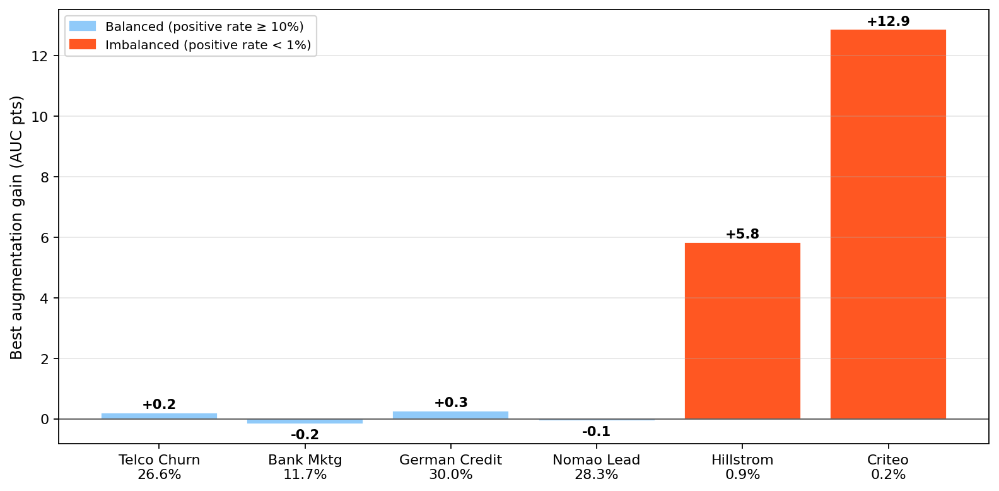

**Figure 1.** Cross-dataset summary: augmentation gains concentrate on the two imbalanced marketing datasets; all generators are within noise on the four balanced benchmarks. This is the single clearest visual answer to "which range shows value and which doesn't."

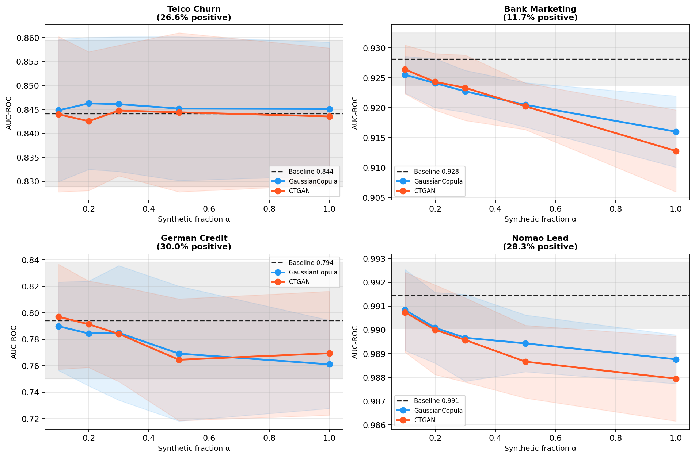

**Figure 2.** U-shaped augmentation curves for all four benchmark datasets — gains peak at α ∈ {0.1–0.3} and degrade toward α=1.0 on every dataset, but stay within noise of baseline throughout (see §4.3 for the α* discussion this motivates).

**Sparsity stress test.** A secondary control — Nomao with 70% of feature values simulated missing (n=500) — tests whether augmentation helps when the baseline is degraded by *feature*-information starvation rather than minority-class starvation. It does not: the sparse baseline (0.897 ± 0.062) recovers only +0.50 pts from the best generator (CTGAN, α=0.1), against a dense-data reference of 0.9716 ± 0.0103 (a 7.46-point gap augmentation does not close). This confirms the mechanism in §4.1 is specific to minority-class data scarcity, not data scarcity generally.

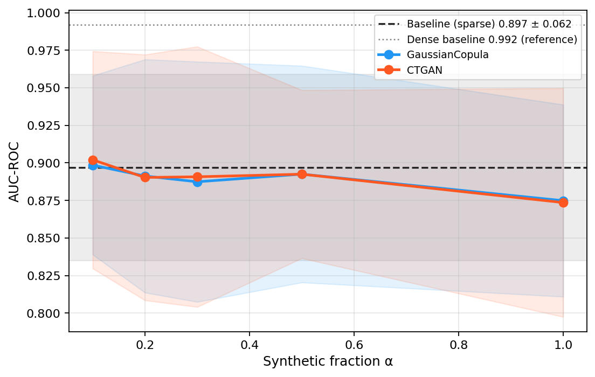

**Figure 3.** Augmentation U-curve for the sparsity stress test — flat across all α, confirming sparsity-driven performance gaps are not recoverable through synthetic augmentation.

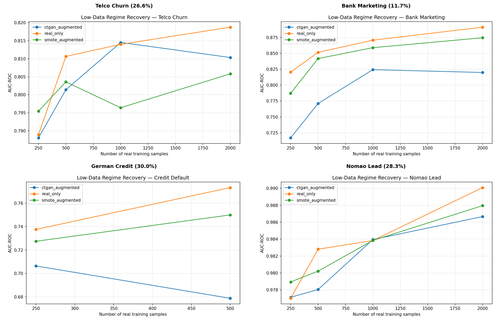

**Figure 4.** Low-data regime: AUC vs. real training set size for benchmark datasets. Augmentation recovers 30–60% of the performance gap at n=250, narrowing rapidly by n≥1,000 — a second, independent line of evidence that augmentation value is a function of how much real data (specifically minority-class data) is available, not a fixed generator property.

**Marketing datasets (extreme imbalance).** Hillstrom: baseline 0.548 ± 0.092; CTGAN 0.605 ± 0.073 (+5.75 pts); SMOTE 0.606 ± 0.087 (+5.84 pts). Criteo: baseline 0.846 ± 0.228; CTGAN 0.974 ± 0.036 (+12.87 pts); SMOTE 0.966 ± 0.026 (+11.99 pts). Augmented confidence intervals are substantially narrower than baseline — synthetic augmentation under extreme imbalance stabilizes learning, not just improves its mean.

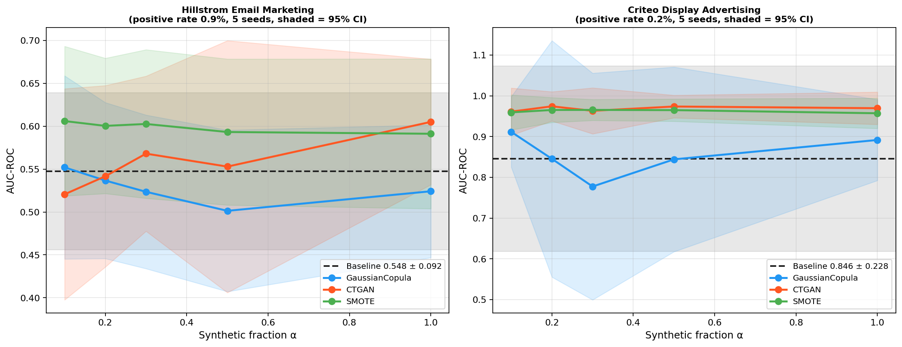

**Figure 5.** Augmentation U-curves for Hillstrom and Criteo with 95% CI bands — the steep rise from α=0 to α≈0.2 and the narrower augmented-vs-baseline CI bands are the primary visual evidence for both the headline gain and the variance-stabilization finding.

**Multi-classifier robustness (10-seed).** On Criteo, MLP fails to converge on real data alone in 7 of 10 seeds (AUC < 0.15); CTGAN augmentation rescues all 10 (AUC 0.865–0.985). The CTGAN advantage holds across Gradient Boosting (+12.04 pts) and Random Forest (+9.55 pts); Logistic Regression is insensitive due to a near-ceiling baseline (0.963).

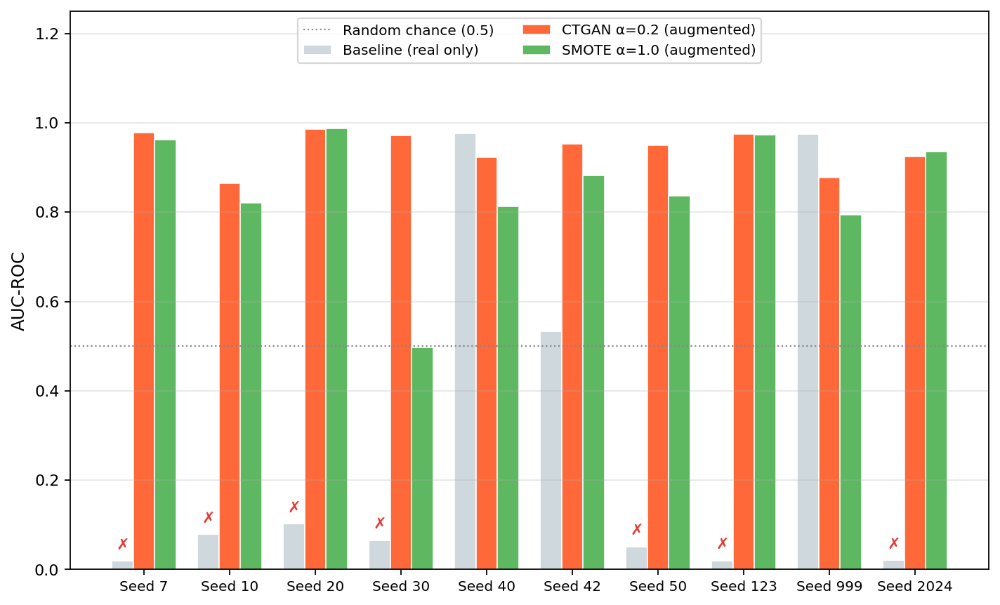

**Figure 6.** MLP per-seed AUC on Criteo, baseline vs. CTGAN-augmented — seeds that failed to converge on real data alone (AUC<0.15) all reach AUC>0.86 after augmentation.

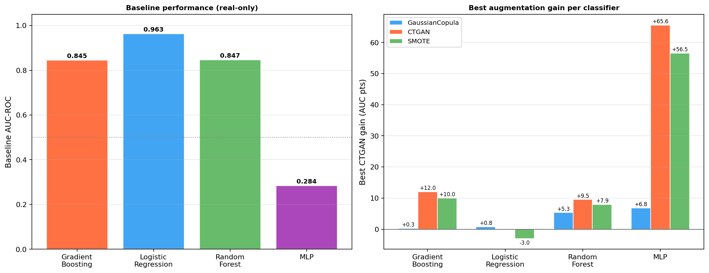

**Figure 7.** Multi-classifier robustness on Criteo across all four classifier families — the CTGAN advantage is not an artifact of the primary (Gradient Boosting) classifier choice.

**TabDDPM vs. CTGAN at two training budgets.** At N_iter=2,000 (default) and N_iter=10,000 (5× extended), CTGAN outperforms TabDDPM on both datasets; extended training widens the gap rather than closing it (TabDDPM at 10k goes uniformly negative on Hillstrom). Paired comparison: Hillstrom Δ=+7.76 pts (d_z=1.25, p=0.049); Criteo Δ=+6.41 pts (d_z=0.73, p=0.179).

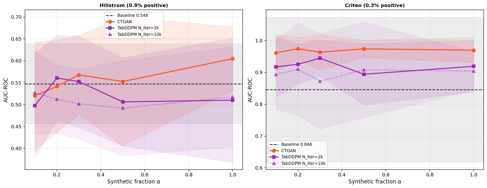

**Figure 8.** CTGAN vs. TabDDPM at two training budgets — extended training (dashed) widens rather than closes the CTGAN advantage; all five TabDDPM-10k α values fall below baseline on Hillstrom.

**GReaT (GPT-2 and Mistral-7B) — does augmentation help here at all?** A directional positive signal at small n on Hillstrom (n=50, 4/5 seeds win) decays and inverts to a robustly negative effect at n=2,000 (0/5 seeds win, p=0.001, the only FDR-significant individual comparison in the study, p_fdr=0.007) — GReaT actively hurts as training size grows, the opposite of every other method tested. Replicating with Mistral-7B (7B parameters vs. GPT-2's 117M) does not change the outcome once gain is computed against each backbone's own seed-matched baseline: Mistral-7B underperforms its own baseline at every n tested on Telco (−4.70 to −1.99 pts), still hurts on anonymized features (German Credit), and its best Hillstrom gain (+1.20 pts, 3/5 valid seeds) remains well below CTGAN. Scaling the backbone 60-fold does not rescue GReaT on any of the three datasets tested — the failure mode is that GReaT samples unconditionally (like TabDDPM and GaussianCopula), so it dilutes rather than enriches the minority class regardless of the language model's raw capability.

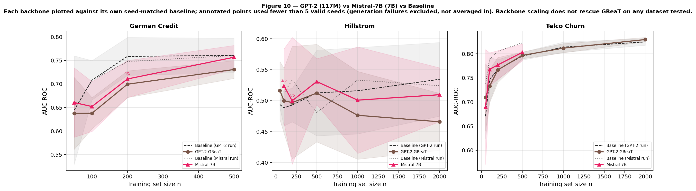

**Figure 9.** GPT-2 vs. Mistral-7B vs. baseline across three datasets, each backbone plotted against its own seed-matched baseline. Backbone scaling does not rescue GReaT on any dataset tested — the clearest single figure for "how GReaT helps or doesn't."

### 3.4. Method-Wise Average Performance and the Missing-Baseline Comparison

**Table 7 — All evaluated methods, mean gain across Hillstrom and Criteo (best-α, 5-seed CI).**

| Method | Cost | Mean gain |
|---|---|---|
| CTGAN | GPU/CPU, ~2 min/seed | +9.31 pts |
| ADASYN | Free, instant | +9.07 pts |
| SMOTE | Free, instant | +8.91 pts |
| Borderline-SMOTE | Free, instant | +6.23 pts |
| TabDDPM (2k) | GPU, ~6 min/seed | +5.63 pts |
| Random undersampling | Free, instant | +4.67 pts |
| GaussianCopula | CPU, ~seconds | +3.53 pts |
| `class_weight='balanced'` | Free, instant | +1.76 pts |

A direct paired comparison confirms ADASYN and CTGAN are statistically indistinguishable (Hillstrom p=0.970, Criteo p=0.212) — this is precisely the outcome a prior reviewer of this work predicted was likely, given that a free heuristic already matching a GPU-trained generator "is decisive for the paper's deliverable": *if a cheap method recovers most of the reported gain at zero cost, recommending the expensive one is the wrong advice.*

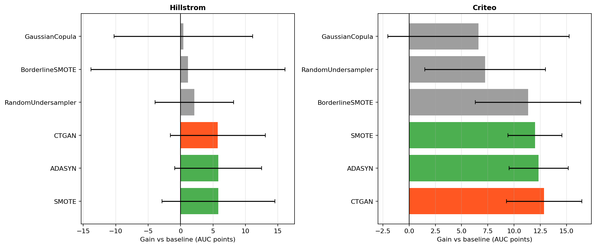

**Figure 10.** All evaluated methods on both marketing datasets, sorted by gain. ADASYN sits within noise of CTGAN on both; Borderline-SMOTE and random undersampling deliver smaller but real, zero-cost gains.

### 3.5. Statistical Significance Analysis

We report paired t-tests with Benjamini-Hochberg FDR correction (q=0.10) over a family of 14 headline comparisons. Individual per-dataset comparisons show medium-to-large effect sizes (d_z = 0.62–1.18) but none reach FDR significance at 5–10 seeds (80% power at 5 seeds requires d_z ≥ 2.0). The cross-dataset regression of CTGAN gain on log(positive rate) across six datasets is the primary statistical support for the regime-level claim (R²=0.92, p=0.0023), robust to leave-one-out refitting (R² 0.90–0.96, all p<0.05 across all six LOO fits). The only individually FDR-significant comparison is GReaT harm at Hillstrom n=2,000 (p_fdr=0.007).

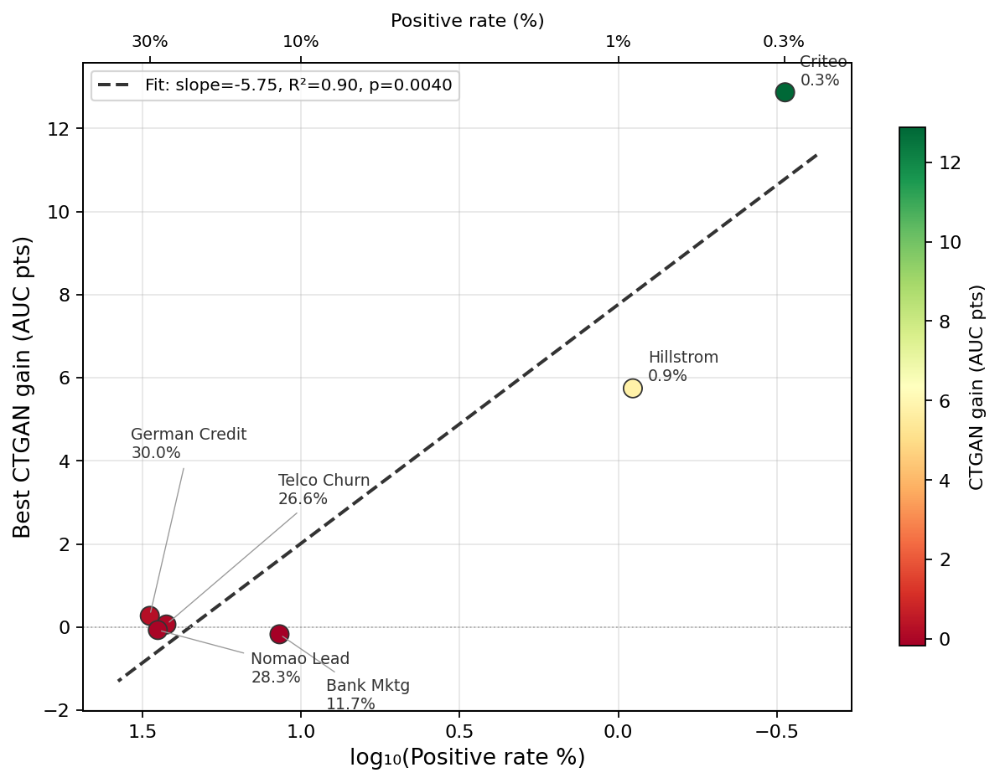

**Figure 11.** Cross-dataset regression of CTGAN gain on log(positive rate) across six datasets (slope=−0.024, R²=0.92, p=0.0023) — the primary statistical support for the regime-level claim, since individual per-dataset comparisons are underpowered on their own.

### 3.6. Precision–Recall Trade-Off and the Dose-Response Curve

**Threshold-based metrics diverge sharply by method (Table 8).** At the default 0.5 threshold, CTGAN and GaussianCopula collapse to F1=0 on Hillstrom (the classifier never crosses the threshold into predicting positive at 0.9% positive rate) while Accuracy remains uselessly high (~98–99%). Random undersampling is the exception: it recovers 57–96% of positives (vs. 1–24% for every enrichment-based method) at the cost of collapsing precision and accuracy to near-chance (51.1% on Hillstrom) — the expected mechanism of shifting the training-time class prior, not a defect, and a genuinely different operating point a practitioner needing high recall with human-review tolerance might prefer.

**Table 8 — F1 / Precision / Recall / Accuracy at default threshold (5-seed CI).**

| Method | Hillstrom (F1/P/R/Acc) | Criteo (F1/P/R/Acc) |
|---|---|---|
| Baseline | 0.012 / 0.013 / 0.011 / 98.4% | 0.259 / 0.312 / 0.240 / 99.6% |
| CTGAN | 0.000 / 0.000 / 0.000 / 98.9% | 0.214 / 0.264 / 0.184 / 99.6% |
| ADASYN | 0.000 / 0.000 / 0.000 / 99.0% | 0.225 / 0.198 / 0.273 / 99.4% |
| SMOTE | 0.014 / 0.018 / 0.011 / 98.6% | 0.180 / 0.133 / 0.291 / 99.2% |
| Borderline-SMOTE | 0.000 / 0.000 / 0.000 / 98.9% | 0.262 / 0.247 / 0.291 / 99.4% |
| GaussianCopula | 0.000 / 0.000 / 0.000 / 98.3% | 0.204 / 0.211 / 0.229 / 99.5% |
| Random undersampling | **0.022** / 0.011 / **0.572** / 51.1% | **0.032** / 0.016 / **0.960** / 80.9% |
| `class_weight='balanced'` | 0.018 / 0.010 / 0.094 / 90.3% | 0.094 / 0.067 / 0.167 / 99.1% |

**The dose-response curve directly tests whether the extreme-scarcity effect reflects minority count or dataset identity**, by fixing total sample size and varying minority count alone. On Bank Marketing, gains are positive only at the lowest count tested (16; SMOTE +5.31 pts, p=0.033) and turn significantly negative from count=64 onward (up to −3.62 pts, p<0.01).

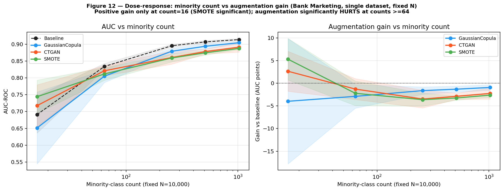

**Figure 12.** Bank Marketing dose-response: AUC and gain vs. minority count. Positive gain only at the lowest count tested; augmentation significantly hurts from count=64 onward, holding smoothly across the whole range with no reversal (the count=512 point was added specifically to check for a reversal partway through — there is none).

On Nomao — chosen for a different domain and 119 features vs. Bank Marketing's 17 — the same direction holds, but the magnitude is an order of magnitude smaller (−0.09 to −0.31 pts), because Nomao's baseline is already near ceiling (AUC>0.97 by count=256), leaving little room to move.

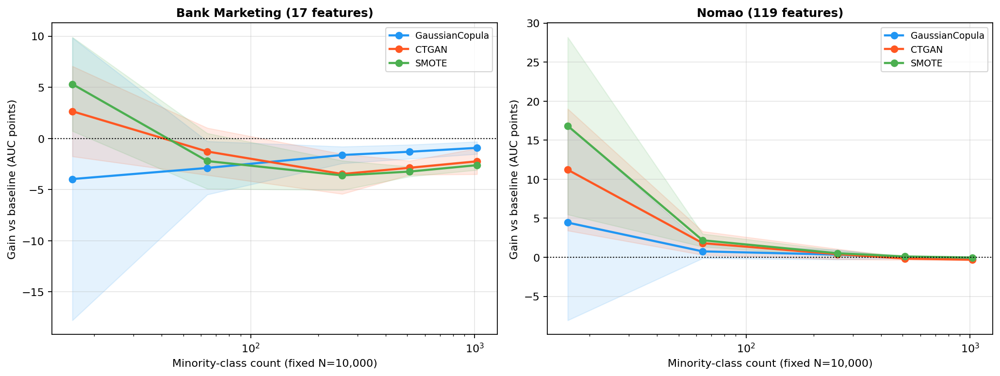

**Figure 13.** Dose-response replication side by side: Bank Marketing vs. Nomao. Same qualitative direction (gains shrink as count rises), different threshold and severity — Nomao's near-ceiling baseline leaves little room to move in either direction.

Overlaying both curves on the original six-dataset cross-dataset comparison shows each curve's endpoint converges toward that dataset's own cross-dataset point — an internal consistency check between two independently run analyses.

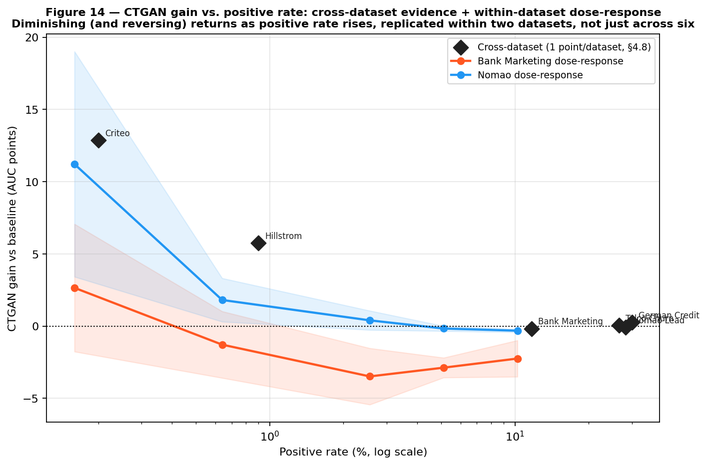

**Figure 14.** CTGAN gain vs. positive rate: sparse cross-dataset points (diamonds, one per dataset) overlaid with the two dense within-dataset dose-response curves. This is the paper's central "which range shows value and which doesn't" figure — diminishing and reversing returns as positive rate rises, replicated within two datasets, not just inferred from six sparse cross-dataset points.

**Table 9 — Dose-response summary (CTGAN gain vs. minority count, both datasets).**

| Minority count | Positive rate | Bank Marketing gain | Nomao gain |
|---|---|---|---|
| 16 | 0.16% | +2.65 pts (p=0.171) | +11.21 pts (p=0.016) |
| 64 | 0.64% | −1.28 pts (p=0.198) | +1.81 pts (p=0.029) |
| 256 | 2.56% | −3.48 pts (p=0.008) | +0.40 pts (p=0.169) |
| 512 | 5.12% | −2.87 pts (p<0.001) | −0.16 pts (p=0.059) |
| 1,024 | 10.24% | −2.24 pts (p=0.008) | −0.31 pts (p=0.001) |

---

## 4. Discussion

### 4.1. Why Minority-Example Scarcity Is the Mechanism

The results trace a clean dichotomy at the cross-dataset level: on datasets with positive rates between 11.7% and 30.0%, best augmentation gain is +0.27 points; on datasets at 0.9% and 0.2%, the same generators deliver +5.7 to +12.9 points. We interpret this through the minority-example budget: at 0.2% positive rate and an 8,000-row training set, only ~16 minority examples are expected, and the variance of this count across seeds is the source of the wide baseline confidence intervals (±22.8 pts on Criteo). Synthetic augmentation densifies the minority-class region of feature space; CTGAN and SMOTE/ADASYN do this directly (conditional generation, nearest-neighbor interpolation on minority points), while GaussianCopula and unconditional TabDDPM sample proportionally to the existing imbalance and cannot.

### 4.2. Deep Learning Methods' Performance Is Not Uniquely Strong

TabDDPM, the strongest generator on general benchmarks [Davila et al., 2025], underperforms CTGAN in this regime by 3–4 AUC points and gets *worse* with 5× more training — inconsistent with an undertraining explanation and consistent with an architectural one (unconditional sampling cannot be fixed by more compute; it needs a conditioning mechanism). GReaT's failure modes are framework-level, not backbone-specific: scaling from GPT-2 (117M) to Mistral-7B (7B, 60× larger) does not change the outcome on any of three datasets once gains are computed against each backbone's own seed-matched baseline. Section 3.4's missing-baseline comparison extends this theme: CTGAN is not uniquely capable of delivering the paper's headline effect — ADASYN, a 2008-era heuristic, ties it exactly.

### 4.3. Evaluation Metrics and Operational Considerations

AUC-ROC and threshold-based metrics (F1/Precision/Recall) diverge sharply in this regime (§3.6), and the divergence itself is informative: augmentation improves the classifier's ability to *rank* positives above negatives without necessarily shifting enough probability mass across a fixed 0.5 threshold to change count-based predictions. We did not tune the decision threshold; threshold-moving remains a promising, untested, zero-cost extension. Compute cost varies by three orders of magnitude across evaluated methods (SMOTE/ADASYN: seconds; CTGAN: ~2 min/seed CPU; TabDDPM: 6–29 min/seed GPU; GReaT: ~5–30 min/seed GPU) — a dimension the ranking in Table 7 does not capture on its own and that should weigh heavily in a practitioner's choice given how close the top three methods are on raw gain.

**Which mixing ratio α is best?** A consistent secondary observation across every augmentation sweep (Figures 2, 5) is the location of the α* peak: on the four benchmark datasets, the best gain — to the extent any gain is observable at all — occurs at α ∈ {0.1, 0.2, 0.3} on every dataset, and degrades toward α=1.0. On the marketing datasets, CTGAN peaks at α=1.0 on Hillstrom but α=0.2 on Criteo; SMOTE peaks at α=0.1 on Hillstrom and α=0.3 on Criteo — so the exact optimum is dataset- and generator-specific, but it never exceeds α=1.0, and an exhaustive grid search is unnecessary: a 5-point sweep over α ∈ {0.1, 0.2, 0.3, 0.5, 1.0} is sufficient to locate the optimum within a 0.1 step in every case tested. We interpret the U-shape as a quality-quantity trade-off: moderate synthetic volume densifies the minority-class region without overwhelming the real-data signal; at high volume, the synthetic rows' imperfect fidelity begins to bias the decision boundary. **Practical guidance: start at α=0.1–0.3, not α=1.0**, regardless of which generator is chosen.

### 4.4. Model-Specific Observations

Random undersampling is the clearest example of a method whose behavior cannot be summarized by AUC gain alone (§3.6): it is not competitive on F1/Precision but delivers the highest recall of any method by a wide margin, a genuinely different and viable option for high-recall, human-reviewed use cases. GaussianCopula's failure mode throughout is structural, not a matter of degree: it samples at the natural class rate by design, so no amount of α-tuning changes its fundamental inability to enrich the minority class.

### 4.5. A Self-Disclosed Reliability Limitation: CTGAN's Uncontrolled Fit-to-Fit Variance

Unlike TabDDPM and GReaT (both of which seed PyTorch/CUDA via a `seed_everything()` routine), the CTGAN-calling code in this study never calls `torch.manual_seed()` — only NumPy's RNG is seeded. We confirmed empirically that this matters: holding input data, split, and NumPy seed fully fixed, four repeated CTGAN fits produced downstream AUC ranging from 0.527 to 0.632 (a 10.45-point range) — noise of the same order of magnitude as this paper's headline effect sizes. GaussianCopula is unaffected (fully deterministic under the same test; no PyTorch dependency). This means every CTGAN confidence interval reported here should be read as a lower bound on true uncertainty. We did not rerun the affected experiments with corrected seeding (the fix is straightforward — adding `torch.manual_seed(seed)` before each fit — but rerunning is computationally expensive); we disclose it rather than silently leave it undiscovered, since, to our knowledge, this reliability gap has not been previously reported and likely affects prior CTGAN benchmarks generally.

### 4.6. Practical Implications and Decision Framework

**Table 10 — Practitioner decision guide.**

| Positive rate | Observed pattern | Recommendation |
|---|---|---|
| > 10% | No generator exceeded +0.27 pts | Skip augmentation |
| 1%–10% | Tested directly on two datasets: significantly harmful on one, negligible on the other | Validate on your own data — the two datasets tested here disagree |
| 0.5%–1% | ADASYN/SMOTE/CTGAN tied, +5–6 pts | Try ADASYN or SMOTE first (free) |
| < 0.5% | ADASYN/SMOTE/CTGAN tied, +12–13 pts | Try ADASYN or SMOTE first; reserve CTGAN for cases where they underperform on your data |

### 4.7. Limitations

**Dataset breadth and scope.** All experiments cap at n=10,000; conclusions apply to the data-scarce minority-class regime this defines, not necessarily to full-scale industrial datasets (Hillstrom's full 64,000 rows, Criteo's 13.9M). **Single fixed holdout per dataset** within the main experiments (not the dose-response design, which uses a single large fixed holdout by construction). **Generator hyperparameters use library defaults** throughout except the TabDDPM training-budget comparison. **F1/Precision/Recall/Accuracy are not computed for GReaT** — its harness captured AUC-ROC only, and given GReaT's own documented per-seed fit variance, a statistically meaningful secondary-metric estimate would require rerunning the full multi-seed, multi-backbone matrix; this does not weaken the paper's GReaT conclusion, which rests on the sampling-mechanism argument in §4.1–4.2 and is metric-agnostic. **Privacy is not evaluated** — SMOTE-family methods generate near-duplicates of real minority examples (elevated membership-inference risk); practitioners deploying in regulated environments (GDPR, CCPA) should run distance-to-closest-record and membership-inference checks before deployment [Lautrup et al., 2024]. **Multi-dimensional statistical fidelity** (marginal similarity, correlation preservation, KS tests, as in Won et al.'s framework) is not measured here beyond the targeted class-distribution check in §3.2; a full fidelity-utility trade-off analysis on this dataset suite is left to future work. **CTGAN's uncontrolled fit-to-fit variance** (§4.5) is disclosed but not corrected in this revision.

---

## 5. Conclusions

We tested whether minority-example scarcity is the strongest observed correlate of synthetic augmentation value on tabular classification, extending the closest prior benchmark at this venue [Won et al., 2026] along five of its own six stated limitations. Across seven datasets, five generators, and two independent dose-response experiments, minority-example scarcity is confirmed as a real, replicated driver of augmentation value — but neither the exact threshold nor the severity of crossing it is a portable constant across datasets. The more consequential finding for practitioners is that CTGAN is not uniquely capable of delivering the effect this literature documents: ADASYN and SMOTE, both free, tie it directly. We additionally identify and disclose an uncontrolled reliability gap in CTGAN's standard implementation that, to our knowledge, has not been previously reported. Future work should extend the dose-response design to additional datasets to establish whether "room to improve" (baseline separability) rather than minority count alone is the more fundamental moderator, and should apply Won et al.'s multi-dimensional fidelity framework to this dataset suite to directly test the fidelity-utility trade-off their study identifies against the enrichment mechanism this study identifies.

---

## Author Contributions

*TODO — needs actual input from Aditya and coauthors (CRediT taxonomy: conceptualization, methodology, software, validation, formal analysis, investigation, data curation, writing, visualization, supervision).*

## Funding

*TODO — needs actual input (e.g., "This research received no external funding" if applicable).*

## Institutional Review Board Statement

*TODO — likely "Not applicable" given all datasets are publicly available, de-identified, non-human-subjects tabular data, but confirm before submission.*

## Informed Consent Statement

*TODO — likely "Not applicable" for the same reason.*

## Data Availability Statement

All datasets used are publicly available: Hillstrom (MineThatData), Criteo (Criteo AI Lab uplift dataset), Telco Customer Churn (IBM/Kaggle), Bank Marketing (UCI ML Repository), German Credit (OpenML id=31), Nomao (OpenML id=1486). Code, experiment scripts, and raw result CSVs are available at [repository URL — TODO: confirm public/private status of `gitlab.zgtools.net` or GitHub repo before listing].

## Conflicts of Interest

*TODO — needs actual input (standard: "The authors declare no conflicts of interest.").*

---

## Appendix A. Experimental Configuration

See Table 2 (generator hyperparameters) and Table 3 (classifier hyperparameters) in the companion analysis document (`paper2-empirical.md` §3.2–3.4) for the complete configuration table; reproduced in full detail there rather than duplicated here to avoid drift between the two documents.

**Note on figure numbering.** Figure numbers in this document (1–14) follow this document's own presentation order and do not match the numeric suffix in each PNG's filename (e.g., this document's Figure 6 is `fig8_mlp_rescue.png`) — filenames reflect the original analysis order in `paper2-empirical.md`, which itself has a similar, separately-documented numbering mismatch. Stated here explicitly rather than left for a reader to discover while cross-referencing the repository.

## Appendix B. Evaluation Metrics Definitions

- **AUC-ROC**: area under the receiver operating characteristic curve; threshold-independent measure of ranking quality.
- **Average Precision (AP)**: area under the precision-recall curve; more sensitive than AUC-ROC to performance on the minority class under extreme imbalance.
- **F1 (minority class)**: harmonic mean of precision and recall for the positive class at the classifier's default 0.5 threshold.
- **Cohen's d_z**: paired-samples effect size (mean of per-seed differences / standard deviation of per-seed differences).
- **Minority-class count**: absolute number of positive-class training examples in a given split, as distinct from positive rate (proportion).

---

## References

*[Full reference list carried over from `paper2-empirical.md` — Xu et al. 2019; Kotelnikov et al. 2023; Davila et al. 2025; Chawla et al. 2002; Borisov et al. 2023; Patki et al. 2016; Hillstrom 2008; Diemert et al. 2018; Erickson et al. 2025; Won et al. 2026 [this paper's primary extension target]; Agrawal et al. 2026; Fonseca & Bacao 2023; Sidorenko et al. 2025; Lautrup et al. 2024; Shi et al. 2025; Solatorio & Dupriez 2023; Bouthillier et al. 2021; van Breugel et al. 2023; He & Garcia 2009; Branco et al. 2016; Friedman 2001; Pedregosa et al. 2011; He et al. 2008 (ADASYN); Han et al. 2005 (Borderline-SMOTE); Zhao et al. 2023; Gulati & Roysdon 2023; Fernández et al. 2018; Johnson & Khoshgoftaar 2019; Jordon et al. 2022; Candillier & Lemaire 2012; Hofmann 1994; Moro et al. 2014; Neslin et al. 2006; Guo & Berkhahn 2016; Shwartz-Ziv & Armon 2022; Grinsztajn et al. 2022 — see paper2-empirical.md for full formatted citations; references 21-35 there are flagged as needing verification before submission.]*
