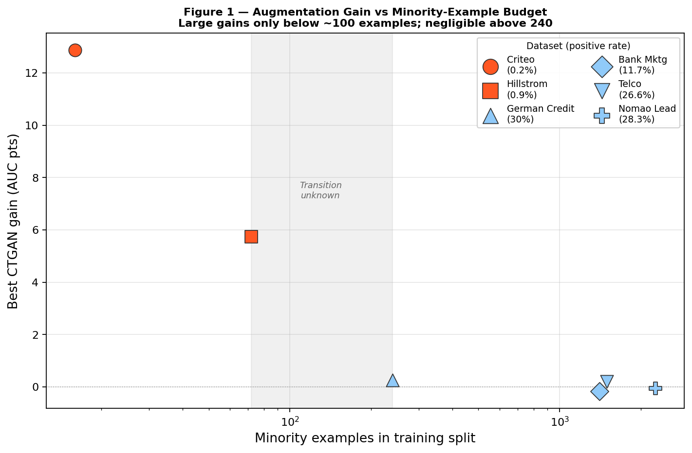
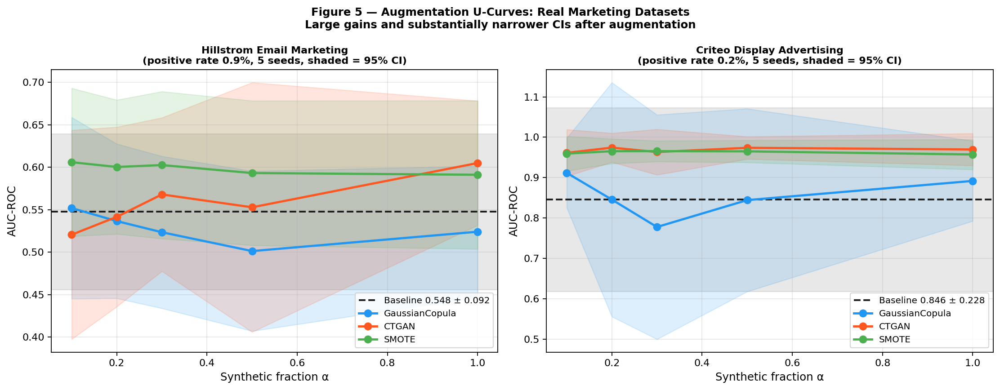

# Synthetic Data Augmentation in the Extreme-Imbalance Regime: Evidence from Marketing Classification

*Complete paper submitted to INFORMS Workshop on Data Science 2026*
---

## Abstract

Marketing and business classification problems routinely have positive rates below 1% - email conversions, fraud, customer churn. At these rates, classifiers often fail to learn useful boundaries because there simply aren't enough positive examples to train on. Synthetic data augmentation is a common fix, but practitioners don't have clear guidance on when it actually works or which generator to use.

We tested five generators — GaussianCopula, CTGAN, SMOTE, TabDDPM, and GReaT (at two LLM scales: GPT-2 and Mistral-7B) — across six datasets spanning 0.2% to 30% positive rates, with up to 10 seeds and four downstream classifiers. The pattern is clear: in the datasets we studied, gains were concentrated in the two datasets with fewer than 100 minority training examples (16 and 72 respectively). In all datasets with 240 or more minority examples, no generator beat the baseline by more than +0.27 AUC points. Our study does not identify an exact transition point — the region between 72 and 240 minority examples is unexplored.

We also measured *why* CTGAN works in this regime: it generates 7–89× more minority-class rows than the natural distribution, directly addressing the data scarcity. TabDDPM and GaussianCopula mirror the real class distribution — at 0.2% positive rate, 99.8% of what they generate is negative class, so they don't help. Scaling up the LLM in GReaT from GPT-2 to Mistral-7B doesn't change this in the default configuration we tested, neither backbone conditions on the minority class.

One important gap: we didn't test datasets in the 1%–10% positive-rate range, so we can't make claims about that region.

---

## 1. Introduction

Class imbalance is a practical problem across business domains. Email conversion rates, fraud signals, customer churn, insurance claims — these events are rare, often below 1% of the data. When that happens, standard classifiers tend to predict the majority class and miss the minority events that actually matter. In marketing, getting this wrong has a direct cost: a missed converting customer is lost revenue, and a missed churning customer means reacting after the fact instead of preventing it (Neslin et al., 2006).

Synthetic data augmentation — generating artificial training examples and mixing them with real data — is one of the standard remedies for this problem (Chawla et al., 2002; He & Garcia, 2009; Johnson & Khoshgoftaar, 2019). The options have grown substantially: SMOTE, conditional GANs (CTGAN), diffusion models (TabDDPM), and LLM-based synthesizers (GReaT). Existing benchmarks rank these generators across many tabular tasks (Erickson et al., 2025; Davila et al., 2025), but they don't answer the question a practitioner actually has: *given my dataset at this positive rate, will augmentation help, and which generator should I pick?*

This paper answers that question empirically. We ran a controlled study across six datasets ranging from 0.2% to 30% positive rates. Table 1 makes the key pattern concrete: the two datasets with the fewest minority training examples (Criteo: 16, Hillstrom: 72) see gains of up to +12.9 AUC points; all datasets with 240 or more minority examples see negligible gains — no generator exceeded +0.27 AUC points. The driver isn't class imbalance in general — it's **minority-example scarcity**, the pattern concentrates in the extreme-scarcity regime — datasets with very low positive rates and correspondingly few minority training examples; our design cannot separate these two characterizations. We do not identify an exact transition threshold; the region between 72 and 240 minority examples is unsampled, and we flag this explicitly as the most important limitation of this study. We also note upfront that we didn't test datasets in the 1%–10% positive-rate range.

**Table 1 — Minority-example budget and baseline AUC by dataset**

| Dataset | Positive Rate | Train Rows | Minority Examples | Baseline AUC* |
|---|---|---|---|---|
| Criteo Display | 0.2% | 8,000 | **16** | 0.846 ± 0.228 |
| Hillstrom Email | 0.9% | 8,000 | **72** | 0.548 ± 0.092 |
| German Credit | 30.0% | 800 | 240 | 0.794 ± 0.044 |
| Bank Marketing | 11.7% | 12,000 | 1,404 | 0.928 ± 0.004 |
| Telco Churn | 26.6% | 5,626 | 1,497 | 0.844 ± 0.015 |
| Nomao Lead | 28.3% | 8,000 | 2,264 | 0.991 ± 0.001 |

\* Baseline AUC is calculated using a GradientBoostingClassifier (n_estimators=100, max_depth=4)

---

## 2. Experimental Setup

**Generators.** We evaluated five generators: GaussianCopula (Patki et al., 2016), CTGAN (Xu et al., 2019), SMOTE (Chawla et al., 2002), TabDDPM (Kotelnikov et al., 2023), and GReaT (Borisov et al., 2023) at two LLM scales — GPT-2 (117M parameters) and Mistral-7B (7B parameters). All generators run with library-default hyperparameters.

**What we measured.** For each dataset-generator-seed combination, we ran three conditions:

1. **Baseline (TRTR):** Train on 80% real data, evaluate on 20% real holdout. This is the no-augmentation benchmark.
2. **TSTR (Train on Synthetic, Test on Real):** Train entirely on synthetic data, evaluate on the real holdout. This measures how faithfully a generator captures the real distribution. In our experiments, no generator closes the TSTR gap — synthetic data supplements real data but cannot replace it.
3. **Augmentation sweep:** Fit the generator on the real training set, generate synthetic rows, combine with real training data, retrain, and compare to baseline.

**TSTR Results — synthetic-only training always underperforms (single-seed point estimates)**

| Dataset | Baseline AUC | Best TSTR AUC | TSTR gap |
|---|---|---|---|
| Telco Churn | 0.837 | 0.803 (GaussianCopula) | −4.1% |
| Bank Marketing | 0.909 | 0.750 (GaussianCopula) | −17.4% |
| German Credit | 0.775 | 0.564 (GaussianCopula) | −27.2% |

Across all three benchmark datasets, no generator closes the TSTR gap. Synthetic data can't replace real data — it can only supplement it. This confirms augmentation (condition 3) is the right framing.

For the augmentation sweep, we controlled the synthetic fraction using **α = n_synthetic / n_real**. We swept α ∈ {0.1, 0.2, 0.3, 0.5, 1.0} — so α=0.2 adds 20% as many synthetic rows as real ones, and α=1.0 doubles the training set. We report the best-α result per generator.

**Downstream model.** Primary classifier: GradientBoostingClassifier (n_estimators=100, max_depth=4) — standard for tabular data (Friedman, 2001; Pedregosa et al., 2011). We also ran Logistic Regression, Random Forest, and MLP to check robustness. Synthetic data is used for training only — never for evaluation.

**Metric.** We use AUC-ROC as the primary metric, selected for comparability with prior synthetic data benchmarks. F1-minority and average precision were computed but are less stable at these positive rates due to small holdout minority counts (16–72 positive test examples). AUC-ROC measures how well a classifier ranks positives above negatives, independent of any threshold; it ranges from 0 to 1 (0.5 = random guessing). We report gains in AUC points (×100): a gain of 0.1287 AUC = +12.87 AUC points. 

**Seeds and holdout.** Two different holdout designs were used, and the reason matters:

- *Augmentation experiments (CTGAN, SMOTE, TabDDPM):* Each seed gets its own independent 80/20 stratified split — both training and test sets change per seed. This is the standard approach when dataset size is large enough for a reliable holdout in every split.

- *GReaT small-n experiments:* The holdout is fixed once upfront (random_state=42) and stays the same across all seeds and training sizes. Only the small training sample changes per seed. We had to do this because at n=50 training rows, a variable split would give us only ~12 test rows — not enough to get stable AUC estimates at 0.9% positive rate. Fixing the holdout to 10,000 rows gives us ~90 positive test examples, which makes comparisons across seeds and training sizes reliable.

**Statistical analysis.** We report 95% confidence intervals using the t-distribution on per-seed AUC values. For pairwise comparisons (e.g., CTGAN vs TabDDPM), we use a **paired t-test** on per-seed AUC differences — the pairing is by seed, so the same data partition is used for both methods. This removes split-to-split noise and isolates the generator effect. Effect size is Cohen's d_z (mean difference / standard deviation of differences; d_z ≥ 0.8 is large). We apply Benjamini-Hochberg FDR correction at q=0.10 for multiple comparisons. All augmentation experiments ran on a MacBook Pro M1 Pro (32 GB RAM); TabDDPM and GReaT ran on an NVIDIA H100 GPU cluster (8× H100).

---

## 3. Core Finding: Augmentation Value Concentrates in the Extreme-Scarcity Regime

Across the five datasets with a positive rate of 11.7% or higher, each of which contains at least 240 minority examples, no generator improves on the baseline by more than +0.27 AUC points at any α. The picture changes on the two marketing datasets. Table 2a shows results for both a fixed pre-specified α=0.3 and the oracle best-α, so readers can assess how much the best-α selection inflates the reported gains.

**Table 2a — Augmentation gains on marketing datasets (5-seed CI, GBC downstream)**

| Generator | Hillstrom α=0.3 | Hillstrom best-α | Criteo α=0.3 | Criteo best-α |
|---|---|---|---|---|
| GaussianCopula | −2.40 pts | +0.44 pts (α=0.1) | −6.80 pts | +6.61 pts (α=0.1) |
| **CTGAN** | **+2.05 pts** | **+5.75 pts (α=1.0)** | **+11.77 pts** | **+12.87 pts (α=0.2)** |
| **SMOTE** | **+5.50 pts** | **+5.84 pts (α=0.1)** | **+11.99 pts** | **+11.99 pts (α=0.3)** |

Baseline: Hillstrom 0.548 ± 0.092; Criteo 0.846 ± 0.228. All gains reported as AUC points (×100).

CTGAN and SMOTE both deliver substantial gains on Criteo at fixed α=0.3. On Hillstrom, SMOTE is more robust to α choice (+5.50 pts at α=0.3 vs its best +5.84), while CTGAN's gains are more α-sensitive (+2.05 pts at α=0.3 vs its best +5.75 at α=1.0). The qualitative conclusion holds at fixed α: both generators help substantially when minority examples are scarce; neither helps when they are not. We did not evaluate datasets in the 1%–10% positive-rate range, and we caution against extrapolating our results into that region.

**Figure 1 — Minority example budget vs. best augmentation gain (CTGAN).** Each point is one dataset. In our study, gains were large only for the two datasets with fewer than 100 minority examples (Criteo: 16, Hillstrom: 72); negligible for all datasets with 240+. The region between 72 and 240 minority examples is shaded grey — this is where we have no observations and the exact transition is unknown.

Criteo offers a useful illustration of what is at stake in this regime. Trained on real data alone, 7 of 10 MLP seeds failed to converge (AUC < 0.15). After CTGAN augmentation, all 10 seeds converged, with a mean AUC of 0.940 ± 0.030 (95% CI). In this setting, augmentation is not a marginal refinement of an already-working model; it is what separates a classifier that trains from one that does not.

**Table 2 — Synthetic positive rate by generator (5 seeds × 8,000 generated rows)**

| Generator | Hillstrom synthetic rate | Criteo synthetic rate | Observation |
|---|---|---|---|
| Real training data | 0.90% | 0.30% | — |
| GaussianCopula | 0.96% ± 0.12% | 0.32% ± 0.06% | Mirrors real — no enrichment |
| TabDDPM | 0.89% ± 0.05% | 0.33% ± 0.09% | Mirrors real — no enrichment |
| **CTGAN** | **6.34% ± 0.21%** | **26.76% ± 1.18%** | **7–89× minority enrichment** |
| SMOTE | 100% (minority only) | 100% (minority only) | Minority targeted by design |
| GReaT (GPT-2, Mistral) | 0.90%† | 0.30%† | †Not directly measured; expected to mirror training distribution |

†Not directly measured; expected to mirror training distribution based on unconditional sampling design as the default configuration (see §5). Both backbones sample unconditionally from the learned joint distribution, so the positive rate in generated rows should reflect the training distribution regardless of backbone scale.

Table 2 points to a direct explanation for this performance gap, but it must be read in two parts. The first is **enrichment**. GaussianCopula and TabDDPM both sample at the natural positive rate of the data, so at a 0.2% positive rate roughly 99.8% of the rows they generate belong to the negative class, and the minority class is left no better represented than before. CTGAN behaves differently: during training it conditions on each class through a log-frequency-reweighted conditional vector (training-by-sampling), which raises the probability that minority modes are drawn and so causes it to learn — and sample — a much higher proportion of minority-class rows at inference time (Xu et al., 2019). This is why CTGAN generates 6.34% positive on Hillstrom (vs 0.90% real) and 26.76% on Criteo (vs 0.30% real). Because we observe these synthetic positive rates directly, the mechanism is measured rather than inferred.

Enrichment alone, however, cannot explain why one should prefer CTGAN to SMOTE — SMOTE enriches to 100% minority, the most aggressive enrichment possible, yet the two recover comparable gains in our experiments. The distinction lies not in *how much* minority data each adds but in *how* each constructs it. SMOTE interpolates: every synthetic point is a convex combination of an observed minority example and one of its minority nearest neighbors, so it falls within the convex hull of the minority examples already present, and the majority class is never consulted (Chawla et al., 2002). This makes SMOTE **boundary-blind** — it can place synthetic minority points inside dense majority regions, the over-generalization problem that motivated Borderline-SMOTE, ADASYN, and Geometric-SMOTE (Han et al., 2005; He et al., 2008; Douzas & Bacao, 2019) — and it tends to produce low-diversity, near-duplicate samples when only a handful of minority seeds exist. CTGAN instead estimates the full joint distribution and conditions on the class label, so its minority samples preserve cross-feature correlations and are informed by where the class boundary actually lies; interpolation-based oversampling is known to degrade precisely where the data are high-dimensional and the distribution is complex (Blagus & Lusa, 2013; Engelmann & Lessmann, 2021). In principle this yields higher-quality minority data. In our extreme regime, where CTGAN must estimate that conditional density from as few as 16 minority rows, the theoretical advantage does not open a measured AUC gap — so we read enrichment as *necessary for any gain* and the generation mechanism as the axis that should guide generator choice when data permit.

Note: Table 2a reports gains at both a fixed pre-specified α=0.3 and the oracle best-α. Best-α is the maximum over the sweep and represents an upper bound on gains a practitioner could achieve with perfect α selection.

For comparison, we also evaluated simple class reweighting (`class_weight='balanced'`) under the same 5-seed protocol, and CTGAN outperforms it by +7.55 AUC points on both datasets.

**Figure 2 — Augmentation U-curves for Hillstrom (left) and Criteo (right) with 95% CI bands.** CTGAN and SMOTE gains peak at α ≈ 0.2–0.3 and degrade toward α=1.0. The shaded baseline CI band (wide on both datasets due to minority-example variance) narrows substantially after augmentation — synthetic data stabilizes learning, not just improves it on average. GaussianCopula stays near baseline throughout.

---

## 4. TabDDPM vs CTGAN

TabDDPM is currently the state-of-the-art generator on general tabular benchmarks (Davila et al., 2025), which makes it a natural point of comparison. We evaluated it at two training budgets: $N_{iter}$=2,000, the library default, and $N_{iter}$=10,000, a fivefold increase. On both Hillstrom and Criteo, CTGAN outperformed TabDDPM at each budget. Extending the training budget did not help TabDDPM and in fact widened the gap: at 10,000 iterations its performance on Hillstrom fell below baseline at every value of α. At this extended budget the CTGAN advantage on Hillstrom reaches an effect size of $d_z$=1.25 (p=0.049).

Table 2 again suggests why, and the reason fits the two-part reading above. TabDDPM samples unconditionally, at the natural positive rate of the data, so it fails at the *first* step — enrichment — regardless of how good its individual samples are; increasing the training budget did not change the sampling distribution we observed. This leads us to suspect that the the limitation is in the default (unconditional) sampling configuration we used: added capacity cannot help a generator that never conditions on the minority class. The two generators also differ substantially in cost: CTGAN fits in roughly 2 minutes on CPU, whereas TabDDPM requires between 6 and 29 minutes on GPU. The broader point is that model sophistication is orthogonal to the property that matters here. TabDDPM is the stronger generator on balanced benchmarks (Davila et al., 2025), yet it loses in our regime because of the aforementioned limitation, not because it lacks capacity — a fivefold budget increase made it *worse*, not better. Class-conditional variants — CTAB-GAN+ (Zhao et al., 2021), conditional diffusion models (TabDiff, Shi et al., 2025) — explicitly target the minority class during generation and are the natural next step; we leave their evaluation to future work.

---

## 5. LLM-Based Synthesis (GReaT)

We next turn to GReaT (Borisov et al., 2023), which takes a different approach: it converts each tabular row into a natural-language sentence (e.g., "recency is 6, history is 230.0, channel is 1, target is 0") and fine-tunes a causal language model to generate new rows by completing such sentences. We evaluated it at α=1.0 (n_synthetic = n_train) across two backbone scales — GPT-2 (117M parameters) and Mistral-7B (7B parameters) — in order to ask whether a larger, more capable language model changes the outcome. We tested GReaT on three datasets chosen to separate two conditions: anonymized features, where feature names carry no meaning (German Credit), and semantic features at different levels of class balance (Hillstrom, with extreme imbalance, and Telco, which is balanced).

**Table 3 — GReaT vs CTGAN: AUC gain over baseline ± 95% CI (5 seeds)** ‡‡

‡‡ Note: GReaT uses a fixed holdout (random_state=42); CTGAN reference values use seed-dependent holdouts. The comparison is directional, not on identical evaluation surfaces.

| Dataset | Condition | GPT-2 GReaT | Mistral-7B | CTGAN reference |
|---|---|---|---|---|
| German Credit | Anonymized, n=100 | −7.02 ± 3.33 pts | −5.59 ± 5.31 pts | +0.27 pts |
| German Credit | Anonymized, n=500 | −3.00 ± 1.90 pts | −0.38 ± 2.52 pts | +0.27 pts |
| Hillstrom | Semantic + extreme imbalance, n=50 | +2.25 ± 4.69 pts | —† | +5.75 pts |
| Hillstrom | Semantic + extreme imbalance, n=100 | +1.15 ± 5.25 pts | +1.20 ± 5.99 pts‡ | +5.75 pts |
| Hillstrom | Semantic + extreme imbalance, n=2000 | **−6.87 ± 4.61 pts** | −1.45 ± 4.35 pts | +5.75 pts |
| Telco | Semantic + balanced, n=100 | −1.38 ± 3.44 pts | −2.15 ± 3.43 pts | +0.28 pts |

†n=50 Mistral-7B on Hillstrom: 4/5 seeds failed to generate parseable rows — excluded from analysis. ‡**Only 3 valid seeds** (2 seeds failed entirely); the wide CI of ±5.99 pts reflects this and this cell should not be used for strong inference.

Three findings emerge from Table 3. First, on the anonymized dataset (German Credit), both backbone scales hurt performance consistently. This is what we would expect if the value of a language-model prior comes from the meaning of feature names, since that meaning is absent here. Second, on Hillstrom, where imbalance is extreme, GReaT does not merely fail to help but exhibits degraded performance as n grows (GPT-2: −6.87 points at n=2,000, $d_z$=−4.40, FDR-significant, p=0.006). The most plausible reading is that, at a 0.9% positive rate, additional LLM-generated rows dilute the minority class rather than enrich it. Third, the larger model offers little: Mistral-7B is marginally less harmful than GPT-2 on German Credit at large n (−0.38 vs −3.00 points at n=500), but on Hillstrom and Telco both models fall below baseline in most conditions. On the extreme-imbalance datasets that matter for marketing, neither scale comes close to CTGAN.

We read this result through the same lens as Table 2. Like TabDDPM, GReaT sampled from the joint distribution without any conditioning on the minority class due to the guided_sampling condition that was applied, so the synthetic positive rate it produces should tend to mirror the training distribution (about 0.9% on Hillstrom) whether the backbone is GPT-2 or Mistral-7B — we did not directly measure GReaT's synthetic positive rate, but this is the expected behavior from its unconditional sampling design. An alternative explanation worth noting: the higher failure rates at very small n (4/5 seeds failing at n=50) could reflect training instability at small dataset sizes rather than the sampling mechanism alone. Both explanations are consistent with the data; we present the sampling account as the more parsimonious reading given its consistency with Table 2. Scaling the language model from 117M to 7B parameters leaves this sampling behavior unchanged, which is consistent with the null effect we observe. This is the clearest evidence in our study that *capability is not the bottleneck*: a roughly 60-fold increase in model size cannot compensate for the absence of a conditioning step, just as the extended training budget could not rescue TabDDPM. The observed pattern is consistent with a limitation: GReaT, in its default configuration, does not condition on the minority class the way CTGAN does, and scaling the backbone does not supply one.

---

## 6. Recommendation and Limitations

**What to do in practice:**

| Positive rate | What we observed | Our recommendation |
|---|---|---|
| > 10% | No generator beat baseline by more than +0.27 pts | Skip augmentation — not worth the effort |
| 1%–10% | **Not tested** | We can't say — validate on your own data before committing |
| 0.5%–1% | CTGAN/SMOTE +5–6 pts | Run CTGAN or SMOTE at α ∈ {0.1, 0.3}; validate before scaling |
| < 0.5% | CTGAN/SMOTE +12–13 pts | Strongly consider CTGAN — it also stabilizes training reliability |

The key practical point: if your positive rate is above 10%, augmentation is unlikely to help based on our results. Figure 2 shows why α ∈ {0.1, 0.3} is the right starting range — gains peak at these values and degrade toward α=1.0 on both marketing datasets. If it's below 1%, CTGAN or SMOTE is worth trying. If it's between 1% and 10% — that's a gap in our study, and you should validate on your own data.

For practitioners choosing between CTGAN and SMOTE: both achieve similar gains in our experiments. SMOTE is simpler, requires no GPU, and has no hyperparameters to tune. CTGAN provides more diverse synthetic samples that preserve feature correlations, which can matter for downstream model quality beyond AUC. For a quick check, start with SMOTE; for production deployments where sample diversity matters, CTGAN is the better long-term choice.

**Limitations.** A few things to keep in mind when applying these results:

- **Only two extreme-imbalance datasets (Hillstrom, Criteo).** The 1%–10% transition region is completely untested. We don't know where the gains start.
- **All experiments capped at n=10,000.** At full dataset scale, you'll have more minority examples, and the gains may be smaller or disappear.
- **We used default hyperparameters for all generators.** A well-tuned TabDDPM might close some of the gap with CTGAN.
- **Privacy and cost not evaluated.** SMOTE generates near-duplicates of real minority examples, which creates membership inference risk in regulated environments (GDPR, CCPA). CTGAN and TabDDPM have moderate risk. Evaluate this before deploying in a production marketing system.

**Where we think LLM-based synthesis goes next.** GReaT and Mistral-7B both fail because they sample from the full joint distribution without targeting the minority class due to the default configuration. The natural next step is context-conditioned synthesis: prompt an instruction-tuned LLM to generate specifically minority-class rows, with metadata about class distributions and feature semantics provided in-context. But the mechanism is what matters, not the model. An LLM pointed only at the minority examples and asked for more of them is **SMOTE with a larger parameter count** — it will interpolate within the observed minority support and inherit the same boundary-blindness. An LLM that first conditions on the full joint distribution and then targets the minority class is doing what CTGAN does, and is the version most likely to close the gap. Our GReaT results are the cautionary case: scale without conditioning buys nothing. We haven't tested the conditioned variant, but it's the obvious follow-on.

---

## References

Blagus, R., & Lusa, L. (2013). SMOTE for high-dimensional class-imbalanced data. BMC Bioinformatics, 14(106). https://doi.org/10.1186/1471-2105-14-106

Borisov, V., Seßler, K., Leemann, T., Pawelczyk, M., & Kasneci, G. (2023). Language models are realistic tabular data generators. Proceedings of International Conference on Learning Representations 2023. 
https://doi.org/10.48550/arXiv.2210.06280

Chawla, N. V., Bowyer, K. W., Hall, L. O., & Kegelmeyer, W. P. (2002). SMOTE: Synthetic minority over-sampling technique. Journal of Artificial Intelligence Research, 16, 321–357. https://doi.org/10.1613/jair.953

Davila Restrepo, M. F., Wollmer, B., Panse, F., & Wingerath, W. (2025). Benchmarking tabular data synthesis: Evaluating tools, metrics, and datasets on prosumer hardware for end-users. Data Science Journal, 24, 37. https://doi.org/10.5334/dsj-2025-037 

Diemert, E., Betlei, A., Renaudin, C., Amini, M. (2018). A large scale benchmark for uplift modeling. Proceedings of the AdKDD 2018.

Douzas, G., & Bacao, F. (2019). Geometric SMOTE: A geometrically enhanced drop-in replacement for SMOTE. Information Sciences, 501, 118–135. https://doi.org/10.1016/j.ins.2019.06.007

Engelmann, J., & Lessmann, S. (2021). Conditional wasserstein GAN-based oversampling of tabular data for imbalanced learning. Expert Systems with Applications: An International Journal, 174 (C). 114582. https://doi.org/10.1016/j.eswa.2021.114582

Erickson, N., Purucker, L., Tschalzev, A., Holzmüller, D., Desai, P. M., Salinas, A. D., & Hutter, F. (2025). TabArena: A living benchmark for machine learning on tabular data. 39th Conference on Neural Information Processing Systems (NeurIPS 2025).16791. https://doi.org/10.48550/arXiv.2506.16791

Friedman, J. H. (2001). Greedy function approximation: A gradient boosting machine. The Annals of Statistics, 29(5). 1189-1232. https://doi.org/10.1214/aos/1013203451 

Han, H., Wang, W. Y., & Mao, B. H. (2005). Borderline-SMOTE: A new over-sampling method in imbalanced data sets learning. Advances in Intelligent Computing (ICIC 2005), 3644. 878–887. https://doi.org/10.1007/11538059_91 

He, H., Bai, Y., Garcia, E. A., & Li, S. (2008). ADASYN: Adaptive synthetic sampling approach for imbalanced learning. IEEE International Joint Conference on Neural Networks (IJCNN). 1322–1328. http://doi.org/10.1109/IJCNN.2008.4633969 

Hillstrom, K. (2008, March 20). The MineThatData e-mail analytics and data mining challenge. MineThatData. https://blog.minethatdata.com/2008/03/minethatdata-e-mail-analytics-and-data.html 

Kotelnikov, A., Baranchuk, D., Rubachev, I., & Babenko, A. (2023). TabDDPM: Modelling tabular data with diffusion models. Proceedings of the 40th International Conference on Machine Learning, 202:17564-17579. https://doi.org/10.48550/arXiv.2209.15421

Patki, N., Wedge, R., & Veeramachaneni, K. (2016). The synthetic data vault. Proceedings of 2016 IEEE International Conference on Data Science and Advanced Analytics (DSAA). 399-410. https://doi.org/10.1109/DSAA.2016.49 

Pedregosa, F., Varoquaux, G., Gramfort, A., Michel, V., Thirion, B., Grisel, O., Blondel, M., Prettenhofer, P., Weiss, R., Dubourg, V., Vanderplas, J., Passos, A., Cournapeau, D., Brucher, M., Perrot, M., & Duchesnay, E. (2011). Scikit-Learn: Machine learning in python. Journal of Machine Learning Research, 12, 2825-2830. https://doi.org/10.48550/arXiv.1201.0490

Shi, J., Xu, M., Hua, H., Zhang, H., Ermon, S., & Leskovec, J. (2025). TabDiff: A mixed-type diffusion model for tabular data generation. International Conference on Learning Representations 2025 (ICLR 2025). https://doi.org/10.48550/arXiv.2410.20626 

Xu, L., Skoularidou, M., Cuesta-Infante, A., & Veeramachaneni, K. (2019). Modeling tabular data using conditional GAN. Neural Information Processing Systems. 7333-7343. https://doi.org/10.48550/arXiv.1907.00503

Zhao, Z., Kunar, A., Van der Scheer, H., Birke, R., & Chen, L. Y. (2021). CTAB-GAN: Effective table data synthesizing. Proceedings of the Asian Conference on Machine Learning (ACML 2021). https://doi.org/10.48550/arXiv.2102.08369 

